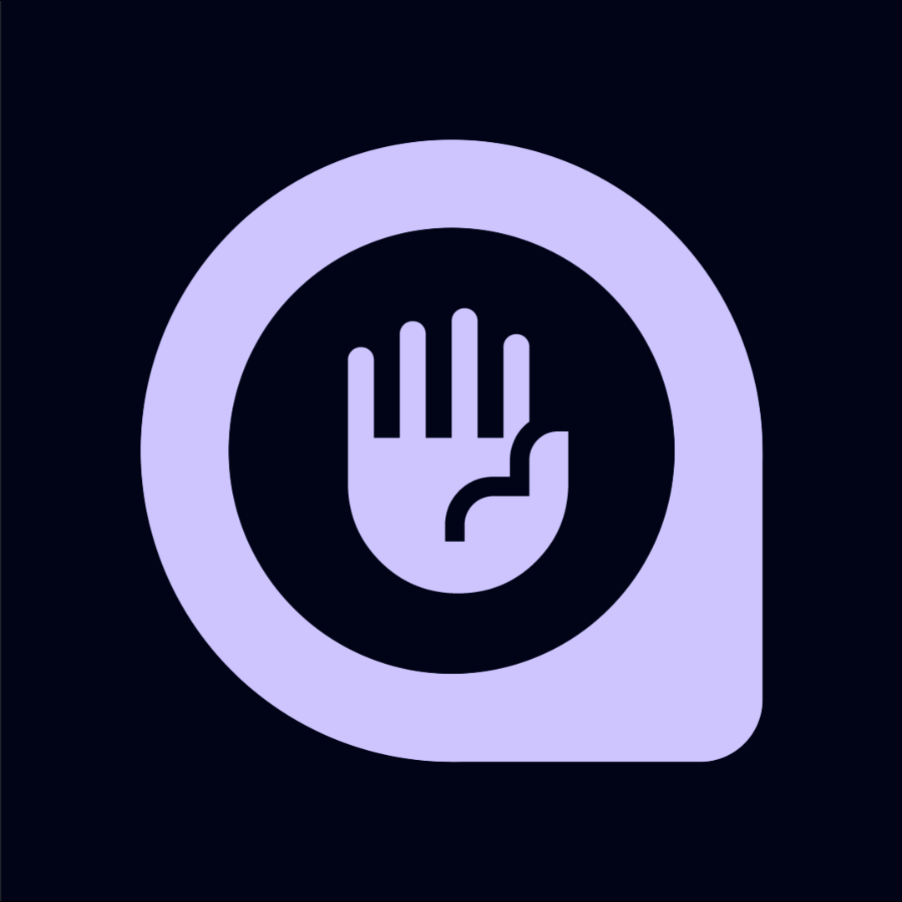

# 🛡️ QUANTIVIRUS

**QUANTIVIRUS** - это Android-приложение для защиты от вредоносного ПО, обеспечивающее непрерывный мониторинг системы и автоматическое обнаружение мессенджера MAX (ru.oneme.app).

## ✨ Особенности

- **🔒 Непрерывная защита** - Антивирус работает в фоновом режиме 24/7
- **🚨 Автоматическое обнаружение** - Мгновенное выявление вредоносного MAX
- **⚡ Автономность** - Автоматический перезапуск сервисов для обеспечения стабильной работы
- **🔄 Мониторинг в реальном времени** - Постоянная проверка установленных приложений
- **📱 Современный UI** - Material You дизайн с интуитивным интерфейсом
- **🔋 Оптимизация батареи** - Умное управление ресурсами системы

## 🚀 Возможности

### Основные функции
- **Антивирусный сканер** - Поиск и обнаружение MAX
- **Фоновый мониторинг** - Непрерывная проверка системы
- **Автозапуск** - Запуск защиты при загрузке устройства
- **Уведомления** - Информирование о статусе защиты
- **Автономность** - Автоматическое восстановление после сбоев

### Технические особенности
- **Foreground Service** - Стабильная работа в фоне
- **Boot Receiver** - Автоматический запуск при перезагрузке
- **Overlay Service** - Отображение предупреждений поверх других приложений
- **Popup Service** - Интерактивные уведомления об угрозах

## 📱 Требования

- **Android API:** 26+ (Android 8.0+)
- **Target SDK:** 34 (Android 14)
- **Минимальная версия:** Android 8.0
- **Архитектура:** ARM64, x86_64

## 🛠️ Установка

### Сборка из исходного кода

1. **Клонируйте репозиторий:**
   ```bash
   git clone https://github.com/eh1oy/quantivirus.git
   cd quantivirus
   ```

2. **Откройте проект в Android Studio**

3. **Синхронизируйте Gradle зависимости**

4. **Соберите проект:**
   ```bash
   # Windows
   .\gradlew.bat assembleDebug
   
   # Linux/macOS
   ./gradlew assembleDebug
   ```

5. **Установите APK на устройство**

### Прямая установка

Скачайте последний релиз APK из раздела [Releases](https://github.com/eh1oy/quantivirus/releases) и установите на устройство.

## 🔐 Разрешения

Приложение запрашивает следующие разрешения для полноценной работы:

- **FOREGROUND_SERVICE** - Работа в фоновом режиме
- **RECEIVE_BOOT_COMPLETED** - Автозапуск при загрузке
- **SYSTEM_ALERT_WINDOW** - Отображение предупреждений
- **QUERY_ALL_PACKAGES** - Сканирование установленных приложений
- **REQUEST_IGNORE_BATTERY_OPTIMIZATIONS** - Стабильная работа

## 🎨 UI/UX

Приложение использует современный Material Design 3 с:
- **Адаптивным дизайном** для различных размеров экранов
- **Темной и светлой темами** с автоматическим переключением
- **Интуитивными жестами** и анимациями
- **Доступностью** для пользователей с ограниченными возможностями

## 🔧 Технологии

- **Язык:** Java 8
- **Минимальный SDK:** Android 8.0 (API 26)
- **Целевой SDK:** Android 14 (API 34)
- **Архитектура:** MVVM с LiveData
- **UI Framework:** Material Components
- **Сборка:** Gradle 8.0+

## 📊 Производительность

- **Потребление памяти:** Оптимизировано для минимального использования RAM
- **Батарея:** Умное управление ресурсами для экономии заряда
- **CPU:** Эффективные алгоритмы сканирования
- **Сеть:** Минимальное использование интернет-соединения

## 🐛 Отчеты об ошибках

Если вы обнаружили ошибку или у вас есть предложение по улучшению:

1. Проверьте [существующие issues](https://github.com/eh1oy/quantivirus/issues)
2. Создайте новый issue с подробным описанием проблемы
3. Приложите логи и информацию об устройстве

## 📄 Лицензия

Этот проект распространяется под лицензией [MIT License](LICENSE).

---

⭐ **Если проект вам понравился, поставьте звездочку!** ⭐

**QUANTIVIRUS** - Защита вашего Android-устройства от мессенджера MAX! 🛡️

---

# 🛡️ QUANTIVIRUS

**QUANTIVIRUS** is an Android application for malware protection, providing continuous system monitoring and automatic detection of the MAX messenger (ru.oneme.app).

## ✨ Features

- **🔒 Continuous Protection** - Antivirus runs in background 24/7
- **🚨 Automatic Detection** - Instant detection of malicious MAX
- **⚡ Autonomy** - Automatic service restart for stable operation
- **🔄 Real-time Monitoring** - Continuous checking of installed applications
- **📱 Modern UI** - Material You design with intuitive interface
- **🔋 Battery Optimization** - Smart system resource management

## 🚀 Capabilities

### Core Functions
- **Antivirus Scanner** - Search and detection of MAX
- **Background Monitoring** - Continuous system checking
- **Auto-start** - Protection launch on device boot
- **Notifications** - Protection status information
- **Autonomy** - Automatic recovery after crashes

### Technical Features
- **Foreground Service** - Stable background operation
- **Boot Receiver** - Automatic launch on reboot
- **Overlay Service** - Warning display over other applications
- **Popup Service** - Interactive threat notifications

## 📱 Requirements

- **Android API:** 26+ (Android 8.0+)
- **Target SDK:** 34 (Android 14)
- **Minimum Version:** Android 8.0
- **Architecture:** ARM64, x86_64

## 🛠️ Installation

### Building from Source

1. **Clone the repository:**
   ```bash
   git clone https://github.com/eh1oy/quantivirus.git
   cd quantivirus
   ```

2. **Open the project in Android Studio**

3. **Sync Gradle dependencies**

4. **Build the project:**
   ```bash
   # Windows
   .\gradlew.bat assembleDebug
   
   # Linux/macOS
   ./gradlew assembleDebug
   ```

5. **Install APK on device**

### Direct Installation

Download the latest APK release from the [Releases](https://github.com/eh1oy/quantivirus/releases) section and install on device.

## 🔐 Permissions

The application requests the following permissions for full operation:

- **FOREGROUND_SERVICE** - Background operation
- **RECEIVE_BOOT_COMPLETED** - Auto-start on boot
- **SYSTEM_ALERT_WINDOW** - Warning display
- **QUERY_ALL_PACKAGES** - Installed application scanning
- **REQUEST_IGNORE_BATTERY_OPTIMIZATIONS** - Stable operation

## 🎨 UI/UX

The application uses modern Material Design 3 with:
- **Adaptive design** for various screen sizes
- **Dark and light themes** with automatic switching
- **Intuitive gestures** and animations
- **Accessibility** for users with disabilities

## 🔧 Technologies

- **Language:** Java 8
- **Minimum SDK:** Android 8.0 (API 26)
- **Target SDK:** Android 14 (API 34)
- **Architecture:** MVVM with LiveData
- **UI Framework:** Material Components
- **Build:** Gradle 8.0+

## 📊 Performance

- **Memory Usage:** Optimized for minimal RAM usage
- **Battery:** Smart resource management for power saving
- **CPU:** Efficient scanning algorithms
- **Network:** Minimal internet connection usage

## 🐛 Bug Reports

If you found a bug or have a suggestion for improvement:

1. Check [existing issues](https://github.com/eh1oy/quantivirus/issues)
2. Create a new issue with detailed problem description
3. Attach logs and device information

## 📄 License

This project is distributed under the [MIT License](LICENSE).

---

⭐ **If you liked the project, give it a star!** ⭐

**QUANTIVIRUS** - Protection of your Android device from MAX messenger! 🛡️
